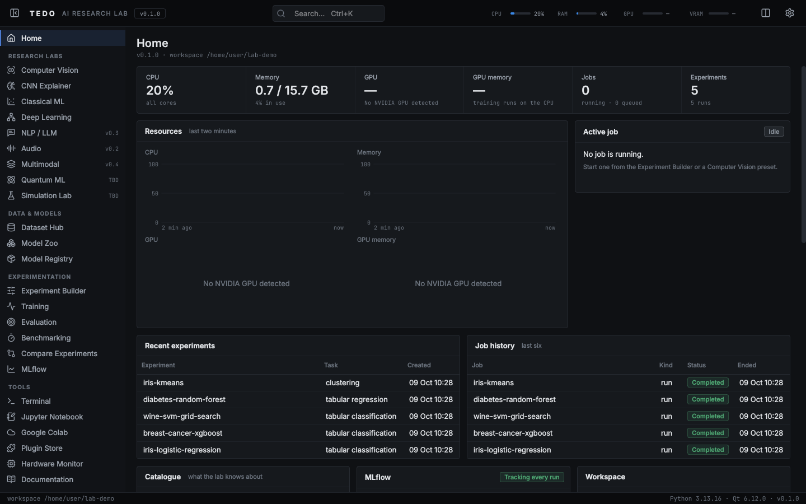
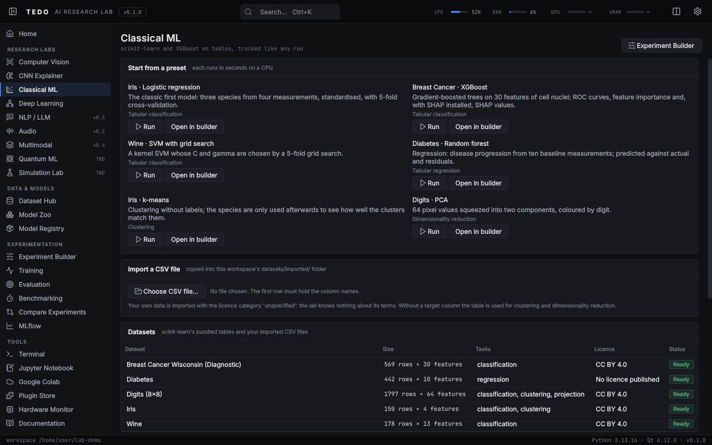
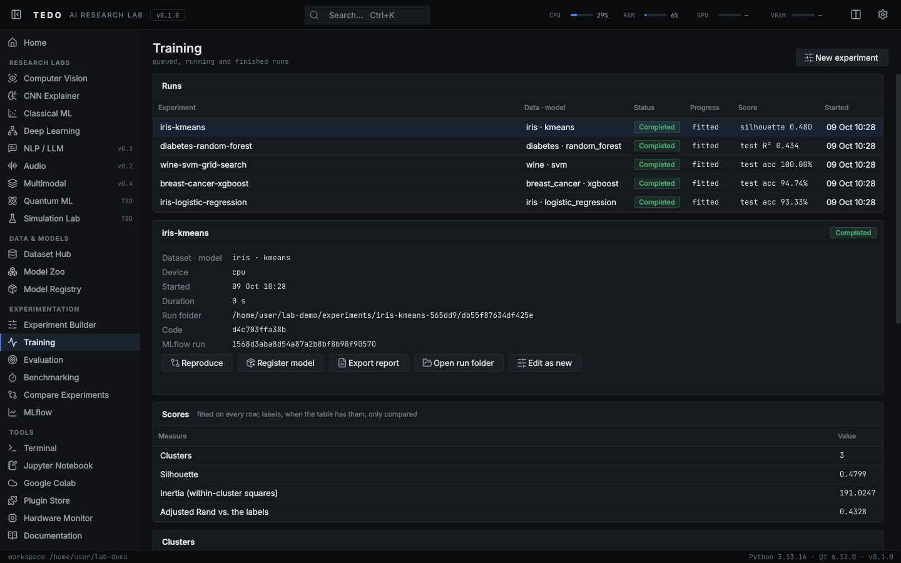
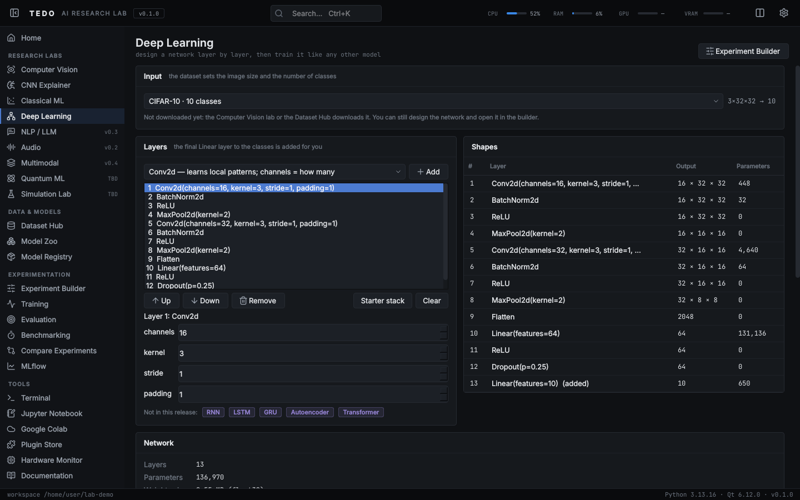
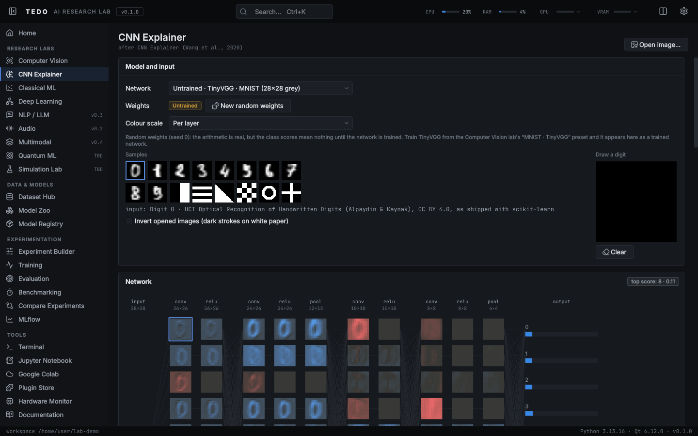
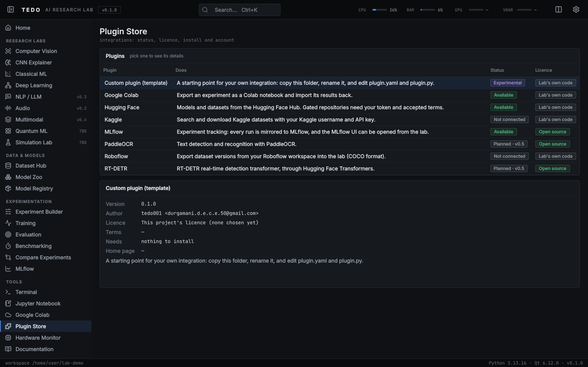
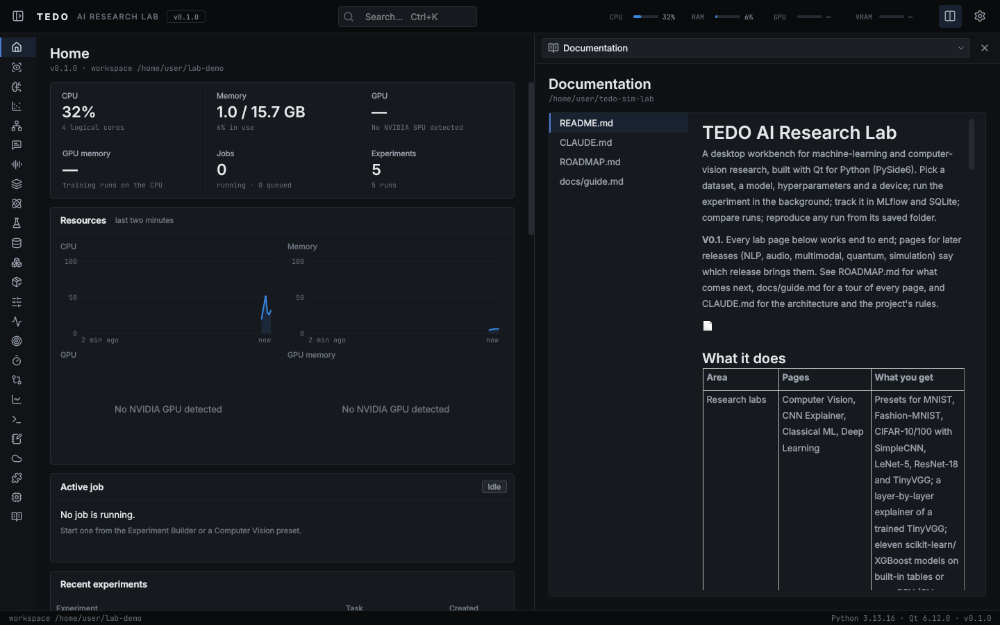

# TEDO AI Research Lab

A desktop workbench for machine-learning and computer-vision research, built with
Qt for Python (PySide6). Pick a dataset, a model, hyperparameters and a device; run the experiment
in the background; track it in MLflow and SQLite; compare runs; reproduce any run
from its saved folder.

**V0.1.** Every lab page below works end to end; pages for later releases (NLP, audio, multimodal,
quantum, simulation) say which release brings them. See [ROADMAP.md](ROADMAP.md) for what comes next,
[docs/guide.md](docs/guide.md) for a tour of every page, and [CLAUDE.md](CLAUDE.md) for the
architecture and the project's rules.



## What it does

| Area | Pages | What you get |
| --- | --- | --- |
| Research labs | Computer Vision, CNN Explainer, Classical ML, Deep Learning | Presets for MNIST, Fashion-MNIST, CIFAR-10/100 with SimpleCNN, LeNet-5, ResNet-18 and TinyVGG; a layer-by-layer explainer of a trained TinyVGG; eleven scikit-learn/XGBoost models on built-in tables or your CSV (CV, search, ROC/PR, permutation importance, SHAP); a layer-stack network designer with live shapes and generated PyTorch code |
| Data & models | Dataset Hub, Model Zoo, Model Registry | 23 datasets and 28 models with licences checked at their sources and downloads only where the terms allow; the ImageNet-1k classes in WordNet (names only); a COCO annotation inspector; versions of your trained models, mirrored into MLflow's registry |
| Experimentation | Experiment Builder, Training, Evaluation, Benchmarking, Compare, MLflow | An experiment is an `experiment.yaml`; it runs in a background worker (cancel, resume, early stopping, AMP, checkpoints), is tracked in SQLite and MLflow, snapshotted for reproduction, re-scored on any split, timed by batch size, compared eight at a time and exported as CSV, JSON, Markdown or PDF |
| Tools | Terminal, Jupyter Notebook, Google Colab, Plugin Store, Hardware Monitor, Documentation | A shell in the workspace; notebooks started from runs and Jupyter Lab on request; Colab notebooks whose results import back as runs; Kaggle, Hugging Face and Roboflow with keyring credentials and licence-first downloads; live CPU/RAM/GPU use |

| | |
| --- | --- |
|  |  |
|  |  |
|  |  |

Everything long runs outside the window: training, evaluation and benchmarks in a worker process,
downloads and searches on background threads. The UI never waits.

## Quick start: one file

Install Python 3.11 or newer (https://www.python.org/downloads/), get the code, then run one file:

```bash
git clone https://github.com/tedo001/tedo-sim-lab.git
cd tedo-sim-lab
python run.py            # Windows: double-click run.bat
```

The first start makes a private environment in `.venv/`, installs PyTorch (the CUDA build when it
finds an NVIDIA GPU, otherwise the CPU build; a few GB) and the lab, then opens the app. Later starts
open it straight away and reinstall only when `pyproject.toml` changes. Started with an older Python,
it looks for Python 3.11+ on the machine and restarts with it; an existing `.venv` made with an older
Python is moved aside (to `.venv-python3.9-old`, say) and replaced. Arguments go to the app
(`python run.py --workspace D:/lab`); `--setup-only`, `--reinstall` and `--cpu` are the launcher's own.

## Install by hand

Python 3.11 or newer.

```bash
git clone https://github.com/tedo001/tedo-sim-lab.git
cd tedo-sim-lab
python -m venv .venv
# Windows: .venv\Scripts\activate    Linux/macOS: source .venv/bin/activate

# PyTorch first. With an NVIDIA GPU, use the CUDA command from https://pytorch.org;
# without one, the CPU build is much smaller:
pip install torch torchvision --index-url https://download.pytorch.org/whl/cpu

pip install -e ".[dev]"
```

Optional extras: `[cv]` (ONNX, ONNX Runtime, Transformers for RT-DETR), `[ocr]` (PaddleOCR, EasyOCR,
Tesseract), `[nlp]` (Transformers, Hugging Face Hub), `[integrations]` (Jupyter Lab, nbformat,
SHAP). The app starts without any of them; the Jupyter page installs Jupyter Lab when you ask.

On Linux, Qt also needs: `libegl1 libgl1 libxkbcommon0 libfontconfig1 libdbus-1-3`.

## Run

```bash
python run.py                            # the launcher (installs on first use)
python -m app.main                       # or: tedo-lab, inside your own environment
python -m app.main --workspace D:/lab    # keep datasets, runs and logs elsewhere
```

Runtime data (datasets, checkpoints, runs, the database, MLflow's store, logs) lives in
the *workspace*: the repository folder by default, or `--workspace` /
`TEDO_LAB_WORKSPACE`. None of it is committed to git.

## Credentials

Integrations read credentials from environment variables or the OS keyring — never
from files. Recognised variables: `KAGGLE_USERNAME`, `KAGGLE_KEY`, `ROBOFLOW_API_KEY`,
`HF_TOKEN`, `GITHUB_TOKEN`. Store or remove them in the OS keyring from the Plugin Store
(Account); Settings shows which are set and where from, never the values; logs mask them.

The Kaggle, Hugging Face and Roboflow plugins talk to each service's public REST API with the
lab's own code (no client libraries). A download lands in `datasets/<source>/` or
`models/<source>/` with a `source.json` recording where it came from and its licence.

## Test

```bash
pytest
QT_QPA_PLATFORM=offscreen python -m app.main --smoke-test
```

## Licences

The lab only uses permissively licensed tools (MIT, Apache-2.0, BSD); copyleft tools such as
Ultralytics YOLO (AGPL-3.0) are excluded. Every dependency's licence is listed in
[configs/dependency_licences.yaml](configs/dependency_licences.yaml) and checked by the tests.
The one exception is the Qt binding, PySide6, which is LGPL-3.0: no permissively licensed
Python binding for Qt exists.

Bundled assets:

- Inter and JetBrains Mono fonts — SIL Open Font License 1.1
  (`app/resources/fonts/OFL-*.txt`)
- Lucide icons — ISC (`app/resources/icons/LICENSE-lucide.txt`)

Ported code:

- The CNN Explainer page is a port of [CNN Explainer](https://github.com/poloclub/cnn-explainer)
  by Zijie J. Wang et al., Polo Club of Data Science, Georgia Tech — MIT
  (`labs/computer_vision/explainer/LICENSE-cnn-explainer.txt`). Its Tiny ImageNet example images
  and pretrained weights are not included: they derive from ImageNet.
- Built-in digit samples come from the UCI Optical Recognition of Handwritten Digits data set
  (CC BY 4.0), read from the copy that ships with scikit-learn.

Datasets: the Classical ML lab reads Iris, Wine, Breast Cancer and Digits (UCI, CC BY 4.0) and
Diabetes (Efron et al. 2004, no licence published) from scikit-learn's own copies; nothing is
downloaded. An imported CSV file keeps the licence category `unspecified`.
